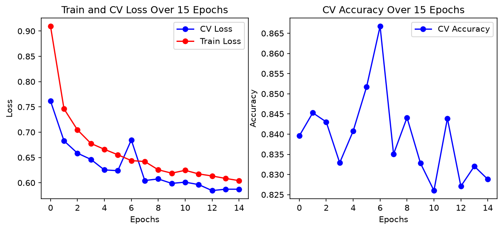

# NASA-ML: Hazardous Asteroid Classification

This project predicts whether a near-Earth object (NEO) is potentially hazardous using data pulled from [NASA's NeoWs API](https://api.nasa.gov/). The ingest pipeline pages through the API, flattens the raw JSON into a Parquet file (with one-hot encoding for categorical fields), and a custom PyTorch `Dataset` handles loading and per-feature normalization. A small feed-forward neural network (linear → batch norm → LeakyReLU blocks) is trained with `BCEWithLogitsLoss`, using a positive-class weight to handle the heavy class imbalance — only ~6% of NEOs are flagged hazardous. The data is split 70/15/15 into train, cross-validation, and test sets, and the checkpoint with the best CV loss is saved for final evaluation.

## Training Results

Both train and CV loss decrease steadily over 15 epochs. Because of the class weighting, the model favors recall (~0.91 on CV) over precision — for hazard detection, missing a dangerous asteroid is worse than a false alarm.
